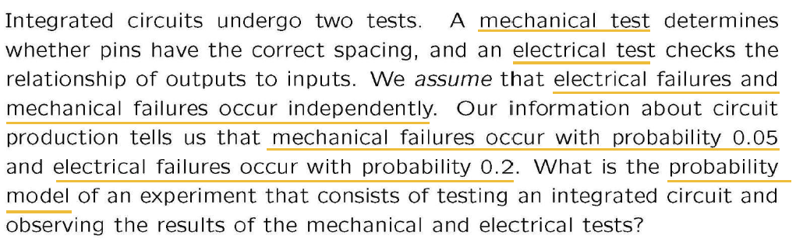
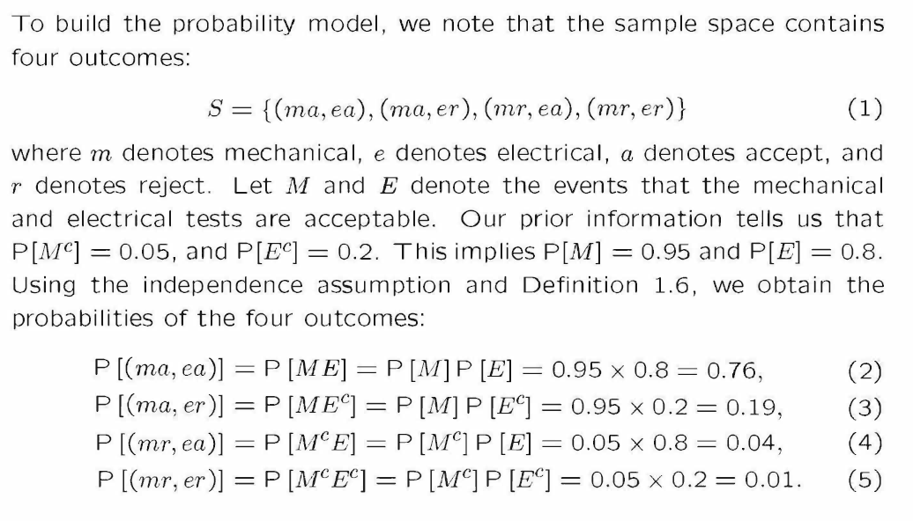
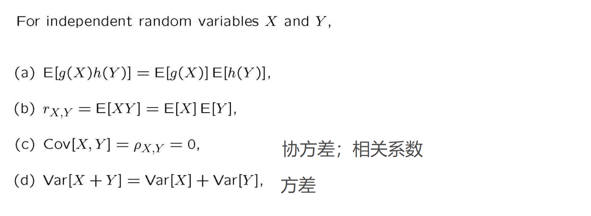

# 概率论与统计复习
[TOC]

[2022-2023回忆卷](https://www.cc98.org/topic/5533411)（请在校网环境下打开）

## 概率的性质

在概率论中，概率有以下基本性质：

1.  非负性：任何事件的概率都不会小于0，即对于任何事件A，有P(A) >= 0。
2.  规范性：样本空间中所有可能事件的概率之和为1，即对于样本空间S，有P(S) = 1。
3.  可列可加性：对于任意可列个互不相交的事件A1，A2，A3，…，有
    
    $$
    P(A1 ∪ A2 ∪ A3 ∪ ...) = P(A1) + P(A2) + P(A3) + ...
    $$
    
4.  对立事件的概率：对于任何事件A，其对立事件（即A不发生的事件）的概率为1-P(A)。
5.  乘法定理：对于两个事件A和B，有P(A ∩ B) = P(A|B) * P(B)，其中P(A|B)为条件概率。
6.  加法定理：对于两个事件A和B，有P(A ∪ B) = P(A) + P(B) - P(A ∩ B)。

补充：P(A - B) = P(A) - P(A|B)

## 条件概率

在概率论中，条件概率是指在已知某个事件发生的前提下，另一个事件发生的概率。如果事件B在事件A发生的条件下发生的概率，即为条件概率，记为P(B|A)。其中，P(B|A)读作“在A发生的条件下B发生的概率”。

条件概率可以用以下公式表示：

$$
P(B|A) = \frac{P(A \cap B)}{P(A)}
$$

其中，P(A ∩ B)表示A和B同时发生的概率，P(A)表示A发生的概率。

需要注意的是，条件概率中的条件是已知的，所以我们可以根据条件概率来计算事件的概率。另外，条件概率也可以用于贝叶斯定理等重要的概率理论中。

补充：$P(\bar{B}|A) = 1-P(\bar{B}|A)=\frac{P(A \cap B)}{P(A)}$

## 全概率与贝叶斯公式

在概率论中，全概率**（Total Probability）**是指一件事件的概率可以通过对该事件的所有可能情况进行加权平均得到。全概率通常用于当我们无法直接计算某个事件的概率时，通过对该事件的所有可能情况进行加权平均来计算该事件的概率。

假设有一系列互不相交的事件B1，B2，B3，…，且它们的并集为样本空间S。对于任意事件A，可以将其分解为对这些事件的条件概率之和：

$$
P(A) = \sum_{i=1}^{\infty}P(A|B_i)P(B_i)
$$

其中，$P(A|B_i)$表示在事件$B_i$发生的条件下A发生的概率，$P(B_i)$表示事件$B_i$发生的概率。这个公式就是全概率公式，它可以帮助我们计算任意事件的概率。

贝叶斯公式**（Bayes Rule）**是概率论中另一个重要的公式，它描述的是在已知某些事件发生的条件下，另一个事件发生的概率。假设我们已知一系列互不相交的事件B1，B2，B3，…，且它们的并集为样本空间S。对于任意事件A，可以通过贝叶斯公式计算在事件$B_j$发生的条件下，A发生的条件概率：

$$
P(B_j|A) = \frac{P(A|B_j)P(B_j)}{P(A)} = \frac{P(A|B_j)P(B_j)}{\sum_{i=1}^{\infty}P(A|B_i)P(B_i)}
$$

其中，$P(B_j|A)$表示在事件A发生的条件下，事件$B_j$发生的概率，$P(A|B_j)$表示在事件$B_j$发生的条件下A发生的概率，$P(B_j)$表示事件$B_j$发生的概率。这个公式就是贝叶斯公式，它可以帮助我们根据已知条件来计算事件的概率。

全概率公式**（Total Probability Theorem）**和贝叶斯公式**（Bayes Rule）**是概率论中非常重要的公式，它们可以帮助我们计算任意事件的概率，也是应用于机器学习、数据挖掘等领域的重要工具。

## 事件的独立性

在概率论中，事件的独立性是指两个事件的发生不会相互影响。换句话说，如果事件A和事件B是独立的，那么事件A发生的概率与事件B发生的概率是相互独立的。也就是说，事件A的发生与否并不会对事件B的发生概率产生影响，反之亦然。

数学上，事件A和事件B的独立性可以通过以下公式表示：

$$
P(A \cap B) = P(A)P(B)
$$

这个公式意味着，如果事件A和事件B独立，那么它们同时发生的概率等于它们各自发生的概率的乘积。

如果事件A和事件B不独立，那么它们同时发生的概率将不等于它们各自发生的概率的乘积，而是要根据它们之间的关系来计算。

## 建立概率模型

**Building a probability model:**

1.  Enumerate all (mutually exclusive) outcomes in sample space列举样本空间中的所有（互斥）结果
    
2.  Calculate outcomes’ probabilities.计算结果的概率
    
    **例子**
    

 
 

## 随机变量分布律与分布函数

在概率论中，离散型随机变量**（discrete random variable）**是指只取有限个或可数个值的随机变量。它的分布律是指随机变量取各个可能值的概率。分布函数是指随机变量小于等于某个数的概率。

随机变量一般用大写字母表示。

#### 离散型随机变量

假设X是一种**离散型随机变量**，其可能取的值为$x1，x2，x3，...，$对应的概率为$p1，p2，p3，...$。那么它的分布律可以表示为：

$$
P(X=x_i) = p_i, i=1,2,3,...
$$

其中，P表示概率，$X=x_i$表示随机变量$X$取值为$x_i$的事件，$p_i$表示事件$X=x_i$发生的概率。

概率质量函数$$P_X(x)=P(X=x)$$

设$$F(x)$$是离散型随机变量X的**分布函数**（CDF)，那么它可以表示为：

$$
F(x) = P(X \leq x) = \sum_{x_i \leq x}P(X=x_i)
$$

其中，$P(X≤x)$表示随机变量X小于等于x的概率，$x_i≤x$表示随机变量X取值小于等于$x_i$。

根据以上公式，我们可以通过分布律求得分布函数，也可以通过分布函数求得分布律。具体地说，如果我们已知分布律，可以通过累加求和的方式来得到分布函数。反之，如果我们已知分布函数，可以通过求导数或者作差的方式来得到分布律。

#### 连续型随机变量

对于连续型随机变量，我们不再使用分布律这个概念，而是使用概率密度函数（Probability Density Function，简称PDF）。因为连续型随机变量能够取到的值是无限的，对于任何一个具体的值，其出现的概率为零，所以无法像离散型随机变量那样定义其每一个值的概率。

假设X是一种**连续型随机变量**，其可能取的值为\[-∞,+∞\].它的分布函数（CDF）可以表示为：

$$
F(x) = P(X ≤ x) = ∫_{-∞}^{x} f(t) dt
$$

在\[a,b\]上的CDF可以表示为：

$$
P(a ＜X ＜ b) = ∫_{a}^{b} f(x) dx
$$

## 独立变量的性质
