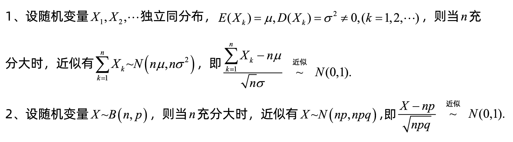

[TOC]

# 中心极限定理

[定义概念资料链接](https://baijiahao.baidu.com/s?id=1665261046335447411&wfr=spider&for=pc)

[3 blue 1 brown 视频：【官方双语】但是什么是中心极限定理？](https://www.bilibili.com/video/BV1gh4y1W7ag/?share_source=copy_web&vd_source=a41a58c9e8c080ffd2ecd3e49b6bb66e)

**中心极限定理（CLT）指出，如果样本量足够大，则变量均值的采样分布将近似于正态分布，而与该变量在总体中的分布无关。**

## 例子
**1**.某炮兵阵地对敌人的防御地段进行100次射击，每次射击中炮弹的命中数是一个随机变量，其期望为2，方差为1.69，求在100次射击中有180颗到220颗炮弹命中目标的概率。

**解**：设Xk表示第k次射击中的炮弹数，则E(Xi)=2，D(Xi)=1.69，且S100\=X1+X2+…+X100，应用中心极限定理，

近似服从N(0,1)，由题意

，所以：

所以在100次射击中有180颗到220颗炮弹命中目标的概率为87.64%.  [4]

**2**.一个复杂系统由100个相互独立的元件组成，在系统运行时每个元件损坏的概率为0.1，为使系统正常工作，至少必须有85个元件工作，求系统的可靠度(正常工作的概率)。

**解：**以X表示100个元件中正常工作的元件数，则X～B(100,0.9)，由二项分布的正态近似，

即正常工作的概率为95.25%