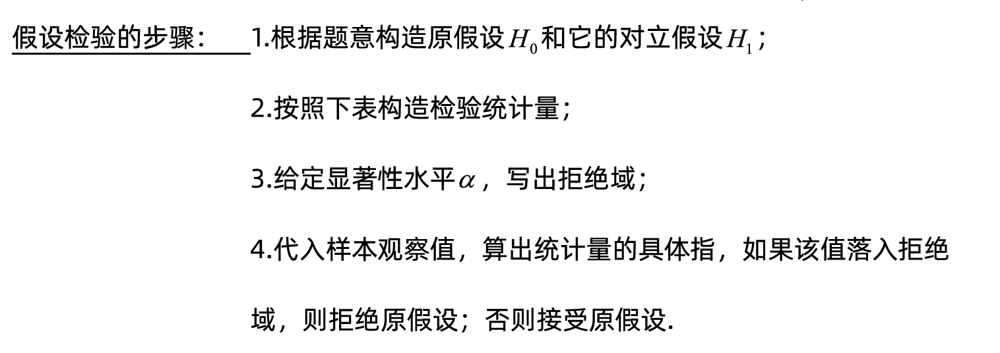
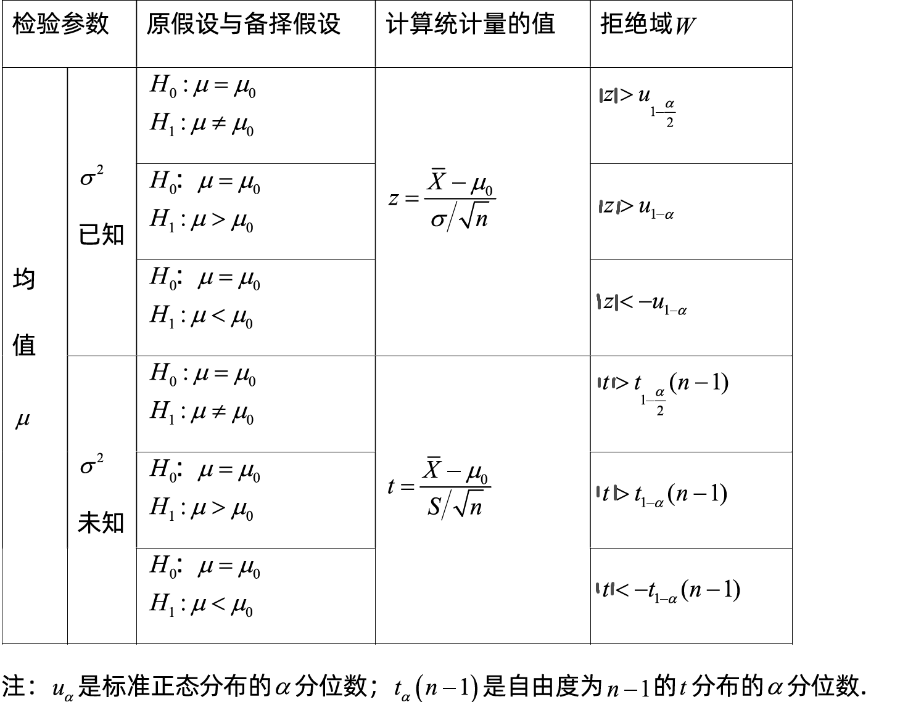
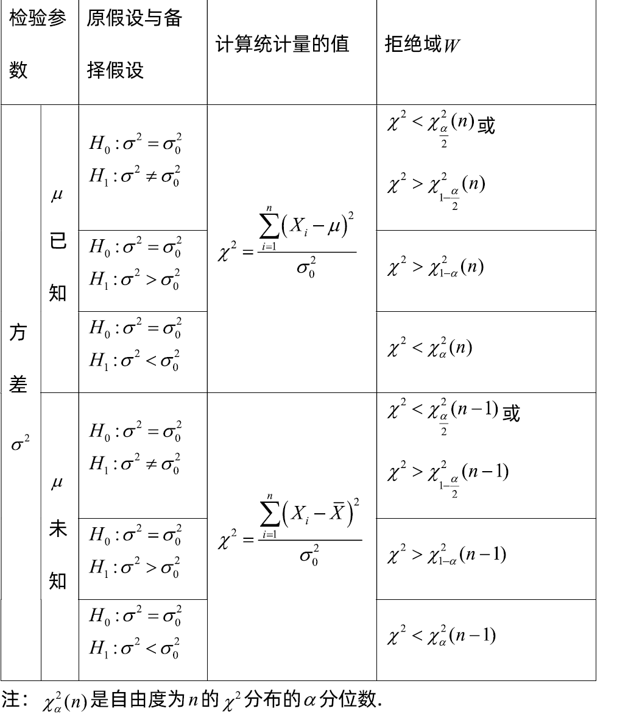
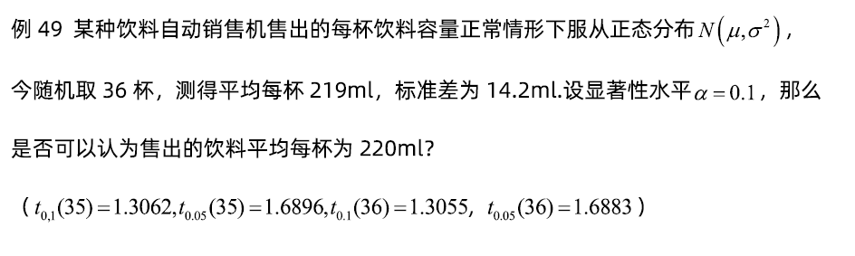
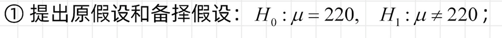
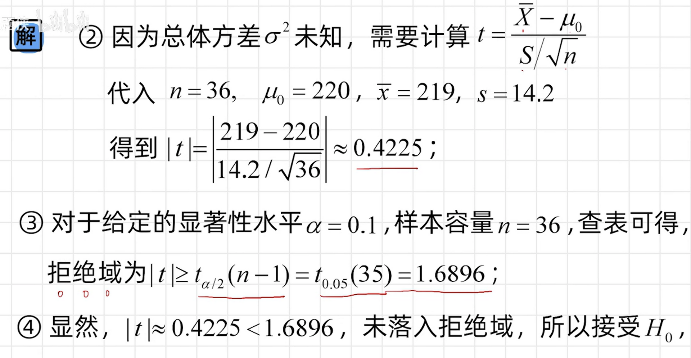

# 什么是假设检验
首先，什么是假设？在数理推断中，总体分布通常是未知的，包含了两类，一类是分布类型未知，一类是分布类型已知，但参数未知，**假设**就是对总体分布的一种推断，比如假设总体服从正态分布，假设正态分布的均值是500。根据未知类型，分为非参数假设和参数假设。**假设检验**就是利用样本来检验假设成立与否。接下来通过几个例子来介绍假设检验可以解决什么问题。  
例子1：某洗衣粉加工机器要求每袋洗衣粉500g，现在随机抽9袋进行检查，发现其重量是：505、499、502、506、498、498、497、510、503，假设$σ = 2$固定不变，问这个加工机器是否合格？  
例子2：某工厂厂灯泡，产出的灯泡服从正态分布， $N = ( u , 40000 )$，平均寿命是1500小时，采用新工艺后，抽样25只，其平均寿命是 $\overline{x} =1675$小时，问采用新工艺后，灯泡寿命是否显著挺高？

# 假设检验的步骤

例题：

