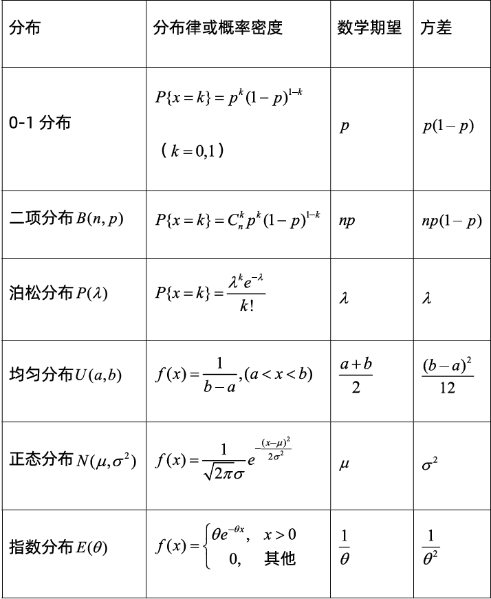
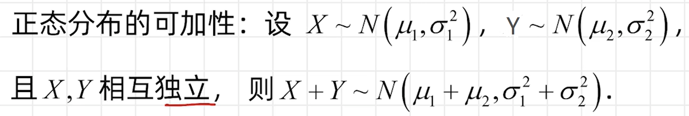
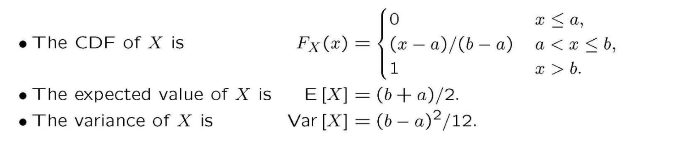
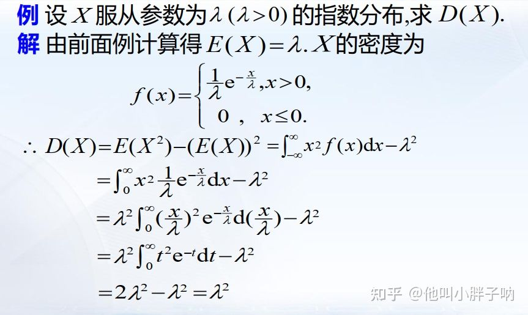
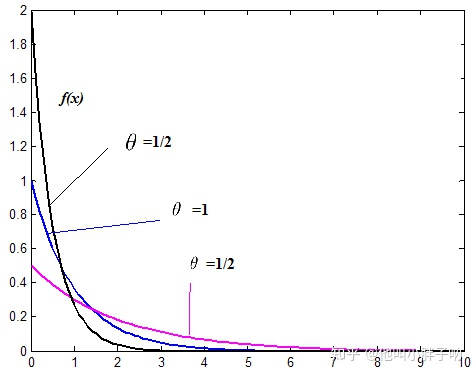
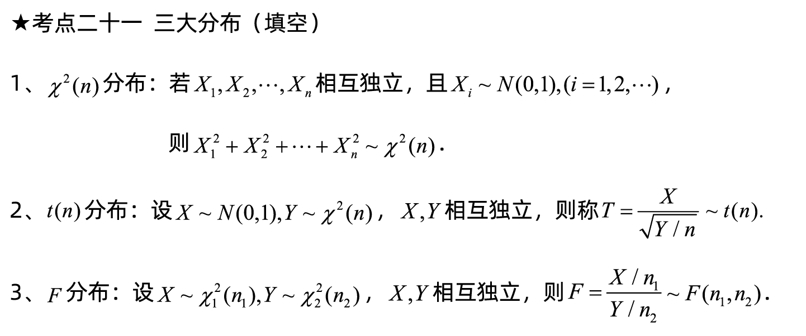

[TOC]

# 常见分布的期望与方差公式

# 离散型随机变量的分布

## 伯努利分布/0-1分布(0-1 distribution)

伯努利分布是一种离散型概率分布，它描述的是一种只有两个可能结果的随机试验，例如抛硬币、赌博等。伯努利分布的参数为$p$，表示试验成功的概率，$1-p$表示试验失败的概率。

假设$X$是一种伯努利分布的随机变量，它只有两个可能的取值，即0和1。其中，1表示试验成功的结果，0表示试验失败的结果。那么伯努利分布的分布律（PMF）可以表示为：

$$
P(X=k)=\begin{cases} p, & k=1 \\ 1-p, & k=0 \end{cases}
$$

其中，k表示随机变量X的取值，p表示试验成功的概率。

伯努利分布的期望和方差可以分别表示为：

$$
E(X)=p
$$

$$
Var(X)=p(1-p)
$$

需要注意的是，伯努利分布是二项分布的一种特例，当试验次数为1时，二项分布就退化为伯努利分布。

伯努利分布在实际问题中有着广泛的应用，例如在机器学习中，伯努利分布常被用来描述文本分类问题中的特征，如某个单词是否出现在一篇文章中等。

- 举例
  
    假设有一个硬币，它正面朝上的概率是0.6，反面朝上的概率是0.4。我们进行一次抛硬币的实验，令X表示这次实验中正面朝上的情况，那么X就是一个伯努利分布。其中，当X=1时，表示正面朝上的情况发生，此时随机变量X取值为1的概率为0.6；当X=0时，表示反面朝上的情况发生，此时随机变量X取值为0的概率为0.4。
    

## 几何分布(Geometric distribution)

几何分布是一种描述二元随机试验中成功所需的独立试验次数的离散型概率分布。假设在重复进行同一试验直到成功为止的过程中，每次试验成功的概率为p，失败的概率为1-p，那么几何分布描述的是这个试验在**第k次才会成功的概率**。其中，k是一个正整数。

假设X是一种几何分布的随机变量，它表示第一次成功所需的试验次数。那么几何分布的概率质量函数可以表示为：

$$
P(X=k)=(1-p)^{k-1}p
$$

其中，k表示试验成功所需的试验次数，p表示单次试验成功的概率，1-p表示单次试验失败的概率。

几何分布的期望和方差可以分别表示为：

$$
E(X)=\frac{1}{p}
$$

$$
Var(X)=\frac{1-p}{p^2}
$$

需要注意的是，几何分布是一种无记忆性分布，也就是说，每次试验的结果都不受前一次试验结果的影响。

几何分布在实际问题中有着广泛的应用，例如在通信、金融、医学等领域中，它被用来描述某些事件的发生概率。

- 举例
  
    假设有一家电商公司，它向客户发送广告邮件，每封邮件被打开的概率是0.2。为了提高营销效果，公司希望了解需要发送多少封邮件才能获得第一次打开邮件的反馈。这个问题可以用几何分布来解决。
    
    我们令X表示电商公司需要发送的邮件数量，才能获得第一次打开邮件的反馈。由于每封邮件打开的概率都是独立的事件，因此每次尝试都是一次伯努利试验。根据几何分布的定义，我们可以得到：
    
    $$
    P(X=k)=(1-p)^{k-1}p
    $$
    
    其中，p=0.2表示单次邮件打开的概率，k是一个正整数，表示电商公司需要发送的邮件数量。
    
    如果我们想要知道，电商公司需要发送多少封邮件才能获得第一次打开邮件的反馈的概率，我们可以计算P(X=k)。例如，如果我们想要知道电商公司需要发送10封邮件才能获得第一次打开邮件的反馈的概率，可以计算：
    
    $$
    P(X=10)=(1-0.2)^{10-1}\times 0.2\approx 0.026
    $$
    
    因此，电商公司需要发送10封邮件才能获得第一次打开邮件的反馈的概率约为0.026。
    

## 二项分布(Binomial Distribution)

二项分布是一种离散型概率分布，它描述了在进行一系列独立的Bernoulli试验中，**成功的次数的概率分布**。例如，假设我们进行n次独立的Bernoulli试验，每次试验成功的概率为p，失败的概率为1-p。那么我们可以定义一个随机变量X，表示n次试验中成功的次数。X就是一个符合参数为n和p的二项分布的随机变量。

二项分布的概率质量函数为：

$$
P(X=k)={n\choose k}p^k(1-p)^{n-k}
$$

其中，n表示试验的次数，p表示单次试验成功的概率，k表示成功的次数。{n\\choose k}表示从n次试验中选择k次成功的组合数。

二项分布的期望和方差可以分别表示为：

$$
E(X)=np
$$

$$
Var(X)=np(1-p)
$$

需要注意的是，二项分布常用于描述质量控制问题，如制造业中的不良品率、医学中的疾病治愈率等。

## 泊松分布(Poisson distribution)

泊松随机变量是一种描述**稀有事件发生次数**的概率分布。例如，在一定时间内某一事件发生的次数，或者在某个区域内某一事件发生的次数等。泊松随机变量的概率分布函数为：

$$
P(X=k)=\frac{\lambda^k}{k!}e^{-\lambda}
$$

其中，k表示**事件发生的次数**，$\lambda$表示**这段时间内或这个区域内平均发生的次数**。

泊松随机变量的期望和方差均为$\lambda$。泊松分布的一个重要性质是：对于一个给定的时间段或区域，如果事件发生的次数满足泊松分布，那么它们之间是独立的。

泊松随机变量在实际问题中有着广泛的应用，例如在电话交换系统中等待电话的数量、在制造业中的缺陷数量、在金融领域中违约次数等等。

- 例子
  
    假设某快递公司的平均每天接收到200个包裹，我们可以用泊松分布来描述每天接收到的包裹数量的概率分布。假设X为某天接收到的包裹数量，则X符合参数为$\lambda=200$的泊松分布。使用泊松分布的概率质量函数，我们可以计算出任意接收到k个包裹的概率：
    
    $$
    P(X=k) = \frac{\lambda^k}{k!}e^{-\lambda} = \frac{200^k}{k!}e^{-200}
    $$
    
    例如，我们可以计算出接收到恰好150个包裹的概率：
    
    $$
    P(X=150) = \frac{200^{150}}{150!}e^{-200} \approx 0.005
    $$
    
    这意味着，按照这个分布，接收到恰好150个包裹的概率非常小，仅约为0.5%。
    
    另外，我们也可以使用泊松分布来计算接收到超过250个包裹的概率。具体地，我们可以计算接收到0个、1个、2个、…、250个包裹的概率之和，然后用1减去这个和，即可得到接收到超过250个包裹的概率。
    

## 帕斯卡分布(Pascal distribution)

帕斯卡分布，也称负二项分布，是一种描述**独立试验中进行k次成功试验所需的试验次数**的概率分布。在进行一系列独立试验的过程中，如果每次试验成功的概率为p，失败的概率为1-p，那么帕斯卡分布描述的是前k次试验中成功的总次数N的概率分布。

假设N是一种帕斯卡分布的随机变量，它表示前k次试验中成功的总次数。那么帕斯卡分布的概率质量函数可以表示为：

$$
P(N=n)={n-1\choose k-1}p^k(1-p)^{n-k}
$$

其中，n表示前k次试验中成功的总次数，{n-1\\choose k-1}表示从前n-1次试验中选择k-1次成功的组合数，p表示单次试验成功的概率，1-p表示单次试验失败的概率。

帕斯卡分布的期望和方差可以分别表示为：

$$
E(N)=\frac{k}{p}
$$

$$
Var(N)=\frac{k(1-p)}{p^2}
$$

需要注意的是，帕斯卡分布是一种离散型概率分布，它与几何分布密切相关，因为它们都描述了在独立试验中进行k次成功所需的试验次数。

帕斯卡分布在实际问题中有着广泛的应用，例如在工程、医学、金融等领域中，它被用来描述一些事件的发生概率，如制造业中的不良品率、医学中的疾病治愈率等。

- 上课的例子1
  
    Perform independent tests of integrated circuits in which each circuit is rejected with probability p. Observe L, the number of tests performed until there are k rejects. What is the PMF of L?
    
    假设有一种集成电路，每个电路都有一定的概率p被拒绝。我们进行一系列独立试验，直到有k个电路被拒绝为止。令L表示进行的试验次数，那么L的概率质量函数（PMF）是？
    
    这个问题可以用负二项分布来解决。负二项分布描述的是在进行独立试验的过程中，需要进行多少次试验才能获得指定数量的成功次数。在本问题中，我们需要进行k次拒绝才能结束试验。因此，L可以表示为前k次试验中成功的总次数。每次试验都是一次伯努利试验，因此根据负二项分布的定义，L的PMF可以表示为：$$P(L=n)={n-1\\choose k-1}pk(1-p){n-k}$$
    
    其中，n表示前k次试验中成功的总次数，{n-1\\choose k-1}表示从前n-1次试验中选择k-1次成功的组合数，p表示单次试验成功的概率，1-p表示单次试验失败的概率。
    

## 伯努利分布、几何分布、二项分布和帕斯卡分布之间的关系

首先，伯努利分布是二项分布的特殊情况，它描述了在一次Bernoulli试验中，成功和失败的概率分布。具体地，如果在一次Bernoulli试验中成功的概率为p，失败的概率为1-p，那么伯努利分布可以描述试验结果为成功或失败的概率分布。伯努利分布的概率质量函数为：

$$
P(X=k)=\begin{cases}p,&k=1\\ 1-p,&k=0\end{cases}
$$

其中，k=1表示试验成功，k=0表示试验失败。

接下来，几何分布是描述进行一系列独立的Bernoulli试验中，需要进行多少次试验才能获得一次成功的概率分布。具体地，如果在每次试验中成功的概率为p，那么几何分布可以描述进行多少次独立的Bernoulli试验才能获得一次成功的概率分布。几何分布的概率质量函数为：

$$
P(X=k)=(1-p)^{k-1}p
$$

其中，k表示进行了多少次试验才获得一次成功。

然后，二项分布是描述进行一系列独立的Bernoulli试验中，获得指定数量成功次数的概率分布。具体地，如果在每次试验中成功的概率为p，那么二项分布可以描述进行n次独立的Bernoulli试验中，获得k次成功的概率分布。二项分布的概率质量函数为：

$$
P(X=k)={n\choose k}p^k(1-p)^{n-k}
$$

其中，n表示试验的次数，k表示成功的次数，{n\\choose k}表示从n次试验中选择k次成功的组合数。

最后，帕斯卡分布（也称为负二项分布）是描述进行独立的Bernoulli试验中，需要进行多少次试验才能获得指定数量成功次数的概率分布。具体地，如果在每次试验中成功的概率为p，那么帕斯卡分布可以描述进行k次Bernoulli试验中，获得n次成功所需进行的试验次数的概率分布。帕斯卡分布的概率质量函数为：

$$
P(X=n)={n-1\choose k-1}p^k(1-p)^{n-k}
$$

其中，n表示前k次试验中成功的总次数，{n-1\\choose k-1}表示从前n-1次试验中选择k-1次成功的组合数，p表示单次试验成功的概率，1-p表示单次试验失败的概率。

需要注意的是，几何分布和帕斯卡分布都是二项分布的特殊情况。几何分布描述的是获得一次成功所需进行的试验次数，因此可以看作是进行无限次Bernoulli试验中成功次数为1时的二项分布。而帕斯卡分布描述的是获得k次成功所需进行的试验次数，因此可以看作是进行无限次Bernoulli试验中成功次数为k时的二项分布。

# 连续随机变量的分布

## 正态分布(Normal Distribution/Gaussian Distribution)

正态分布（**Normal Distribution**），也称为高斯分布（**Gaussian Distribution**），是概率论中最重要的分布之一。它具有以下特点：

1.  对称性：正态分布在其均值处具有对称性，即左右两侧的概率密度相等。
2.  单峰性：正态分布的概率密度函数呈现单峰形态，即在均值处具有最大值。
3.  可控制性：正态分布可以通过两个参数来控制，分别是均值（$\mu$）和标准差（$\sigma$）。均值决定了分布的中心位置，标准差则决定了分布的变化幅度。

正态分布可以记作 $Gaussian (\mu,\sigma)$

正态分布的概率密度函数（PDF）为：

$$
f(x;\mu,\sigma)=\frac{1}{\sqrt{2\pi\sigma^2}}e^{-\frac{(x-\mu)^2}{2\sigma^2}}
$$

其中，$x$代表随机变量的取值，$\mu$代表均值，$\sigma$代表标准差。

正态分布的期望是均值（$\mu$），方差为标准差（$\sigma$）的平方。

因此，设$X$为服从正态分布的随机变量，则有：

$$
E(X)=\mu
$$

$$
Var(X)=\sigma^2
$$

正态分布的CDF没有一个简单的解析形式，但可以用标准正态分布的CDF来计算。标准正态分布是指均值为0，标准差为1的正态分布。因此，对于任意一个正态分布$X$，其CDF可以表示为：

$$
F(x;\mu,\sigma)=P(X\leq x)=P\left(\frac{X-\mu}{\sigma}\leq\frac{x-\mu}{\sigma}\right)
$$

将$\frac{X-\mu}{\sigma}$表示为$Z$，则有：

$$
F(x;\mu,\sigma)=\Phi\left(\frac{x-\mu}{\sigma}\right)
$$

其中，$\Phi(z)$表示标准正态分布的CDF。可以使用查表或计算机软件来计算标准正态分布的CDF。

则$P(a\lt X\leq b) = \Phi\left(\frac{b-\mu}{\sigma}\right) - \Phi\left(\frac{a-\mu}{\sigma}\right)$

- Example 1
  
    Suppose your score on a test is $x=46$, a sample value of the $Gaussian(61,10)$ random variable. Express your test score as a sample value of the standard normal random variable $Z$.
    
- Example 2
  
    If $X$ is the $Gaussian (61,10)$ random variable, what is $P[X \leq 46]$?
    
- Example 3
  
    If $X$ is the $Gaussian (61,10)$ random variable, what is $P[51 \lt X \leq 71]$?
    
- Example 4
  
    In an optical fiber transmission system, the probability of a bit error is
    $Q(\sqrt2)$ ,where y is the signal-to-noise ratio. What is the minimum value
    of $\gamma$ that produces a bit error rate not exceeding $10^{-6}$?
    

## 均匀分布(Uniformly distribution)

均匀分布是指在一个区间内各个数值出现的概率相等的一种随机分布。“均匀”这一概念可以理解为，在任何子区间上，变量的取值概率相等。它概率密度函数(PDF)为：

$f(x)=\begin{array}{c} \frac{1}{b-a} , a<x<b \\ 0,  else\end{array}$

其中，a和b分别为区间的上下限。

均匀分布的特点是，它的概率密度函数为常数，即该分布内每一个数据点出现的概率都是相等的。这种均匀分布常常用在地球上的气温、降雨量等自然现象中，也常常用于随机抽样、随机数生成等情景中。
## （负）指数分布(Negative exponential distribution )

 **1.定义：**

设随机变量X具有如下形式的密度函数

$f(x)=\left\{\begin{array}{c} \frac{1}{\theta} e^{-\frac{x}{\theta}}, x>0 \\ 0, x \leq 0 \end{array} \quad(\theta>0)\right.$

则称X服从参数为θ的指数分布, 记为X~EXP(θ).

其**分布函数**为：

$F(x)=\left\{\begin{array}{c} 1-e^{-{\theta}{x}}, x\ge 0 \\ 0, x < 0 \end{array} \quad(\theta>0)\right.$

 **2.数学期望与方差**

 **指数分布X~EXP(λ)的数学期望： λ**

**例题：**设X 服从参数为λ (λ>0)的指数分布,求E(X).

**解**：X 的密度函数为

$f(x)=\left\{\begin{array}{c} \frac{1}{\lambda} e^{-\frac{x}{\lambda}}, x>0 \\ 0, x \leq 0 \end{array} \right.$

$\begin{aligned} \therefore E(X) &=\int_{-\infty}^{\infty} x f(x) \mathrm{d} x \\ &=\int_{0}^{\infty} \frac{x}{\lambda} \mathrm{e}^{-\frac{x}{\lambda}} \mathrm{d} x=\lambda \cdot \int_{0}^{\infty} \frac{x}{\lambda} \mathrm{e}^{-\frac{x}{\lambda}} \mathrm{d}\left(\frac{x}{\lambda}\right) \\ &=\lambda \cdot \int_{0}^{\infty} t \mathrm{e}^{-t} \mathrm{~d} t \\ &=\lambda \end{aligned}$

 **指数分布X~EXP(λ)的方差：λ^2**

 **3.应用：**

指数分布通常用来描述生命周期（生物、产品……） .

**θ的含义** 是平均寿命的意思。

（越长寿的概率越小）

 **4.性质：**

**无记忆性 ：**

设X~EXP(θ) ，则对于t, s>0, P{X>t+s | X>s} = P{X>t}

x表示一个东西的寿命。

一个东西在使用s寿命的情况下，再有t寿命的概率和一开始预测他有t寿命的概率是一样的。

或者说：一个东西买回来用了一段时间之后的寿命，和买回来时候的寿命一样长

# 三大分布
