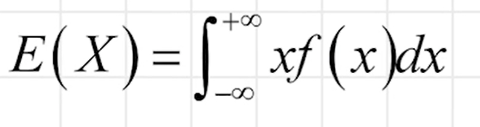
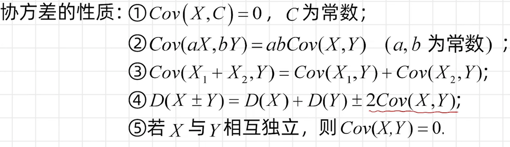
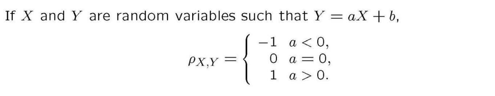
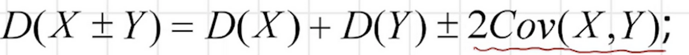
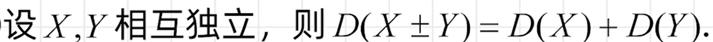
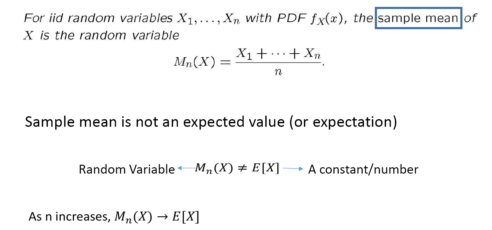
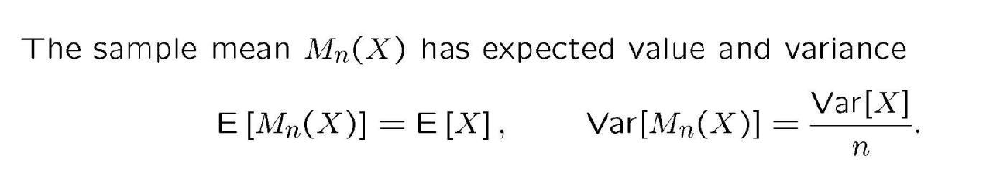
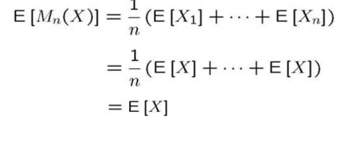
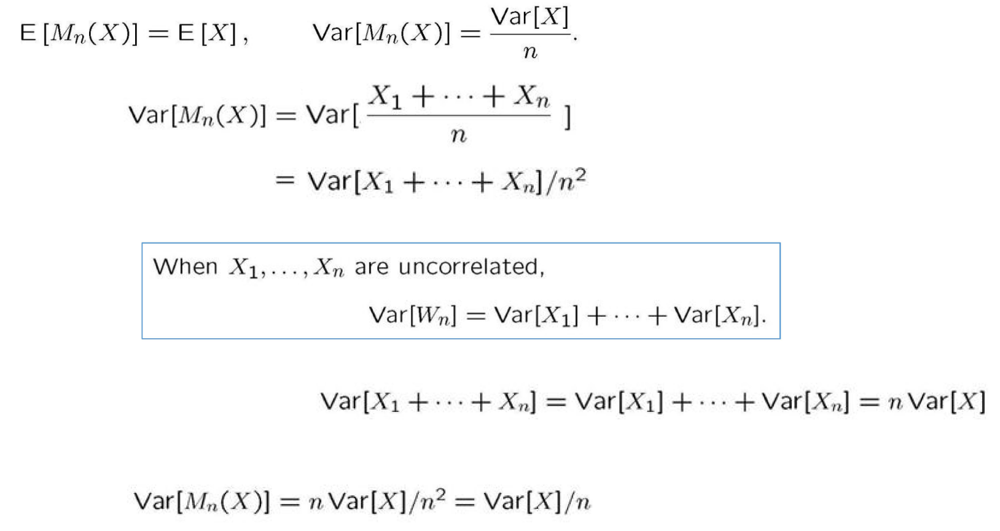

[TOC]

# 期望

期望**（Expectation）**是描述随机变量平均取值的一个指标。以离散型随机变量为例，设X为一个取值为$x_1,x_2,...,x_n$的离散型随机变量，其概率质量函数为$p(x_i)$，则X的期望为：

$$
E(X)=\sum_{i=1}^n x_i p(x_i)

$$

若X为连续型随机变量，其概率密度函数为f(x)，则其期望为：

若为联合密度函数f(x,y),则期望为：
$E(X)=∫∫xf(x,y)dxdy$
$E(Y)=∫∫yf(x,y)dxdy$
$E(g(X,Y))=∫∫g(x,y)f(x,y)dxdy$

期望可以理解为随机变量的平均取值。对于连续型随机变量，期望的定义也是相似的，只不过是用积分替代了求和。

期望有许多重要的性质，例如线性性、单调性、刻画方差等等。其中，期望的线性性是最基本的性质之一，它可以表示为：

$$
E(aX+bY)=aE(X)+bE(Y)

$$

其中，a和b是常数，X和Y是两个随机变量。这个性质可以帮助我们计算复杂随机变量的期望。

若X,Y**相互独立**，则有：

$$
E(XY)=E(X)E(Y)
$$

# 方差（Variance）

方差（**Variance**）是描述随机变量取值分散程度的一个指标。以离散型随机变量为例，设X为一个取值为$x_1,x_2,...,x_n$的离散型随机变量，其概率质量函数为$p(x_i)$，则X的方差为：

$$
Var(X)=E[(X-E(X))^2]=\sum_{i=1}^n (x_i-E(X))^2 p(x_i)
$$
$$
=E(X^2)-E(X)^2
$$

其中，$E(X)$表示X的期望。方差可以理解为随机变量偏离期望的程度的平均值。

# 标准差（Standard Deviation）
方差的平方根称为标准差**（Standard Deviation）**。标准差也是描述随机变量分布的重要指标之一，它的计算方法为：

$$
SD(X)=\sqrt{Var(X)}
$$

# 协方差（Covariance）

协方差（**Covariance**）是描述两个随机变量之间关系的一个指标。协方差可以用来衡量这两个随机变量的变化趋势是否一致。以两个随机变量X和Y为例，设它们的期望分别为$E(X)$和$E(Y)$，则它们的协方差为：

$$
Cov(X,Y)=E[(X-E(X))(Y-E(Y))]=E(XY)-E(X)E(Y)

$$

协方差的值可以是正数、零或负数。当两个随机变量的取值趋势一致时，协方差为正数；当两个随机变量的取值趋势相反时，协方差为负数；当两个随机变量的取值没有明显的关系时，协方差为零。

# 相关系数（Correlation Coefficient)
协方差的大小并不能直接说明两个随机变量之间的关系强度，因为它受到两个随机变量本身变化幅度的影响。因此，我们通常会使用相关系数（Correlation Coefficient）来衡量两个随机变量之间的关系强度。相关系数是协方差除以两个随机变量的标准差的乘积，其计算公式为：

$$
Corr(X,Y)=\frac{Cov(X,Y)}{SD(X) SD(Y)}

$$

其中，$SD(X)$和$SD(Y)$分别表示X和Y的标准差。

# 不知道是啥的 corrleation（相关性？）
qz:The correlation of X and Y is $\gamma_{x,y}= E(XY)$
# 联系
方差和标准差都是衡量随机变量取值分散程度的指标。它们越大，就表示随机变量的取值越分散；它们越小，就表示随机变量的取值越集中。

方差和期望有着紧密的关系。例如，对于一个常数a和一个随机变量X，有：

$$
Var(aX)=a^2 Var(X)

$$

不管X,Y是否独立

# 样本均值(Sample Mean)

推导：

