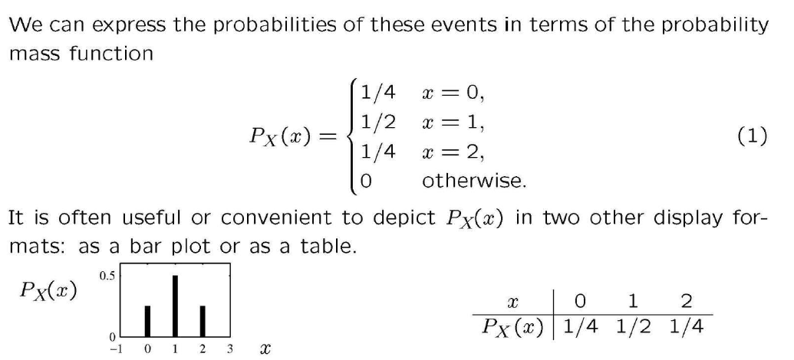
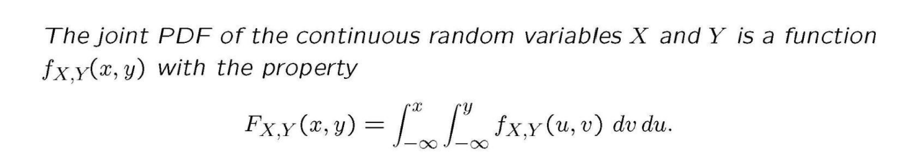
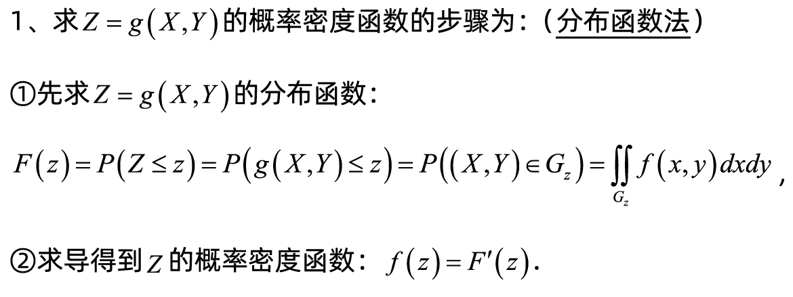
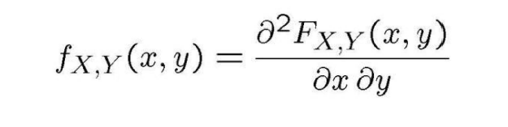
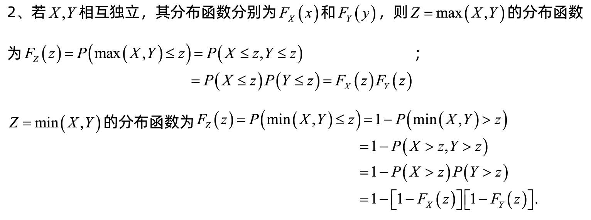

[TOC]

# PMF:概率质量函数

概率质量函数（**Probability Mass Function**), 在概率论中，概率质量函数是**离散随机变量**在各特定取值上的概率。

## 离散型随机变量X的PMF

$$
P_X(x)=P[X=x]
$$

## 联合概率质量函数(Joint PMF)

在概率论中，联合概率质量函数是用于描述两个或多个离散型随机变量的概率分布的函数。它可以表示为 $P(X=x, Y=y)$，其中 $X$ 和 $Y$ 分别表示两个离散型随机变量，$x$ 和 $y$ 分别表示这两个随机变量可能的取值。联合概率质量函数可以帮助我们计算两个或多个离散型随机变量同时取某个值的概率，并从中推断出这些随机变量之间的关系。
**离散型随机变量PMF的表示形式：**

## 边缘概率质量函数(Marginal PMF)

边缘概率质量函数是指从联合概率分布中得到某个随机变量的概率分布函数，即将多个随机变量的联合概率分布转化为其中一个随机变量的概率分布的过程。边缘概率质量函数可以通过对联合概率质量函数进行求和或积分得到。

例如，在两个离散型随机变量 $X$ 和 $Y$ 的联合概率质量函数 $P(X=x, Y=y)$ 中，如果我们想要计算单个随机变量 $X$ 的概率分布，可以使用以下公式：

$$
P(X=x) = \sum_y P(X=x, Y=y)
$$

其中 $y$ 表示随机变量 $Y$ 可能的取值。

类似地，对于两个连续型随机变量 $X$ 和 $Y$ 的联合概率密度函数 $f_{XY}(x,y)$，我们可以通过积分来计算单个随机变量 $X$ 的概率密度函数：

$$
f_X(x) = \int_{-\infty}^{\infty} f_{XY}(x,y) dy
$$

# PDF：概率密度函数

概率密度函数**（Probability Density Function）**, 在数学中，连续型随机变量的概率密度函数（在不至于混淆时可以简称为密度函数）是一个描述这个随机变量的输出值，在某个确定的取值点附近的可能性的函数。本身不是概率，取值积分后才是概率。

概率密度函数有如下性质：

1.  对所有的x，有$f(x) ≥ 0$
2.  概率密度函数在全实数域上的积分为1，即：$∫_{-∞}^{∞} f(x) dx = 1$
3.  若$$f(x)$$连续，则$F'(x)=f(x)$
## 联合概率密度函数（Joint PDF）

# CDF:累积分布函数

累积分布函数 **(Cumulative Distribution Function)**，又叫分布函数，是概率密度函数的积分，能完整描述一个实随机变量X的概率分布。是PDF在特定区间上的积分。 CDF就是PDF的积分，PDF就是CDF的导数.

## 联合分布函数(Joint CDF)

# 一些分析结论和注意点：
1）PDF是连续变量特有的，PMF是离散随机变量特有的；
2）PDF的取值本身不是概率，它是一种趋势（密度）只有对连续随机变量的取值进行积分后才是概率，也就是说对于连续值确定它在某一点的概率是没有意义的；
3）PMF的取值本身代表该值的概率。

