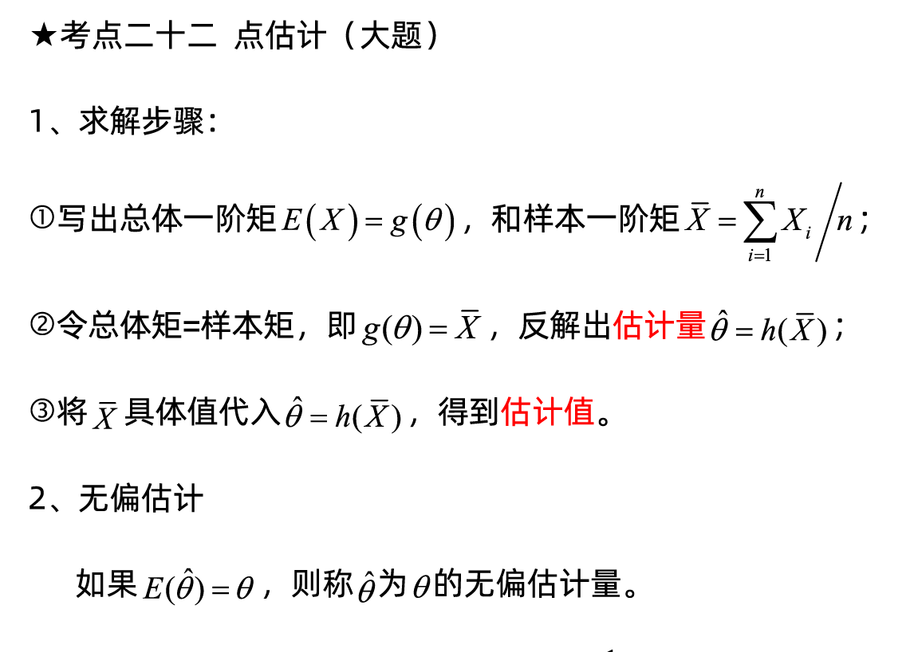
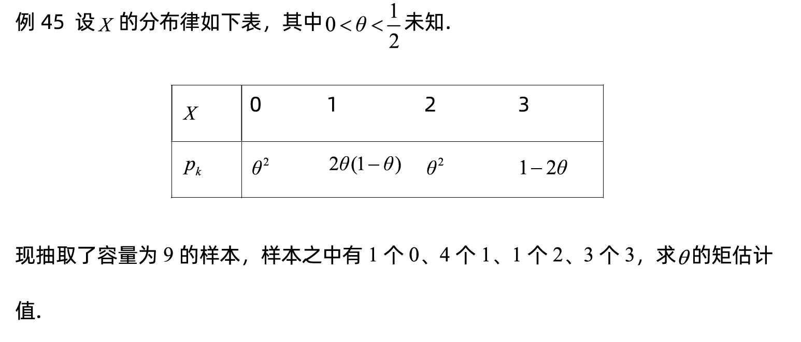
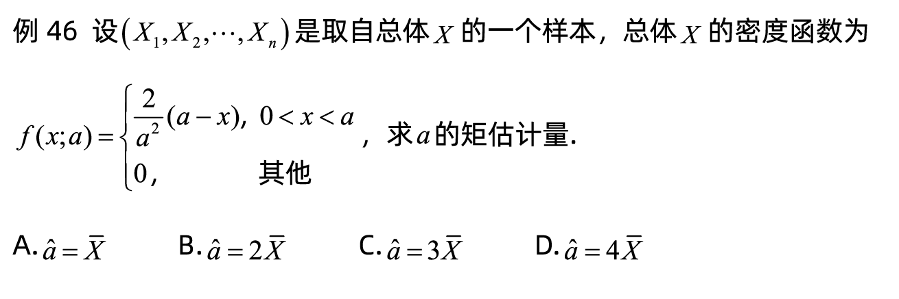
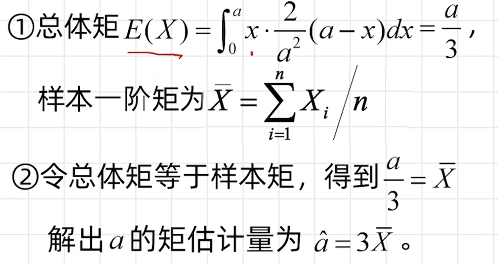
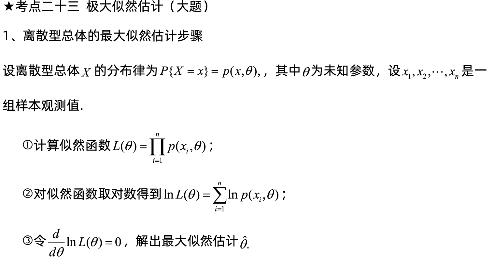
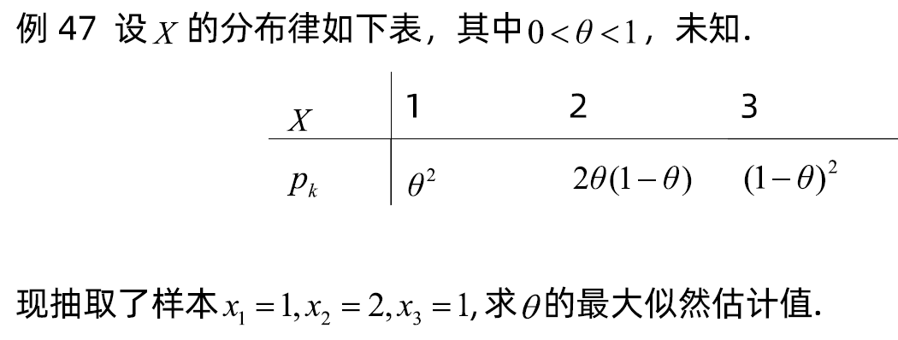
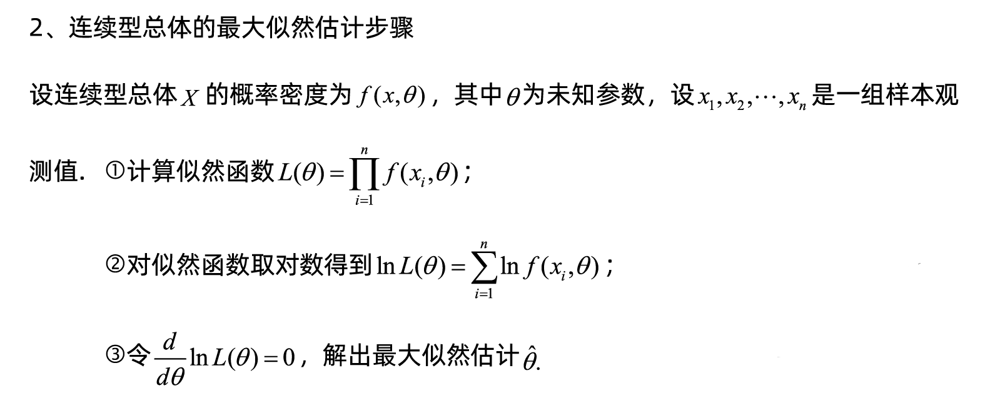
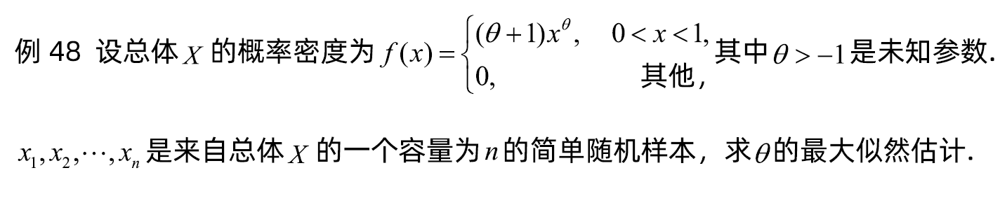

[toc]
# 点估计(Point Estimates)

## 矩估计(Moment method of estimation)
### 离散型随机变量矩估计

### 连续型随机变量矩估计

## 极大似然估计(Maximum likelihood estimation)
**最大似然估计的目的就是：利用已知的样本结果，反推最有可能（最大概率）导致这样结果的参数值。**
结果和参数相互对应的时候，似然和概率在数值上是相等的，如果用 θ 表示环境对应的参数，x 表示结果，那么概率可以表示为:P(x|θ)
P(x|θ)是条件概率的表示方法，θ 是前置条件，理解为在 θ 的前提下，事件 x 发生的概率，相对应的似然可以表示为：L(θ|x)
可以理解为已知结果为 x ，参数为 θ (似然函数里 θ 是变量，这里说的参数和变量是相对与概率而言的)对应的概率，即： L(θ|x)=P(x|θ)
两者在数值上相等，但是意义并不相同，L 是关于 θ 的函数，而 P 则是关于 x 的函数，两者从不同的角度描述一件事情。
概率描述的是在一定条件下某个事件发生的可能性，概率越大说明这件事情越可能会发生；而似然描述的是结果已知的情况下，该事件在不同条件下发生的可能性，似然函数的值越大说明该事件在对应的条件下发生的可能性越大。
### 离散型总体的最大似然估计

①构造似然函数：$L(\theta)=P(X=1)P(X=2)P(X=3)=2\theta^5(1-\theta)$
②取对数$ln(L(\theta))=ln2+5ln\theta+ln(1-\theta)$
③两边对\theta求导，$\frac{d}{d\theta}ln(L(\theta))=\frac{5-6\theta}{\theta(1-\theta)}$
令其等于0.解出最大似然估计值为$\hat\theta=\frac{5}{6}$
### 连续型总体的最大似然估计

# 区间估计
略